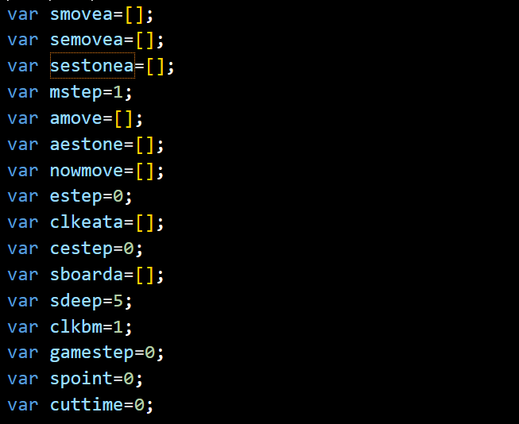

# 跳棋文档


## 棋子玩家类


1. 
   当值为 1 时，表示该位置有一个白棋子，函数将设置相应的棋子图片和阴影图片。boarda：这是一个代表跳棋游戏棋盘状态的数组。 它包含 50 个元素，代表棋盘上的 50 个位置。 数组中的值可以是-1、0、1、10、-10、500、-500、5000、-5000或1000，代表每个位置的不同状态

当值为 -1 时，表示该位置有一个黑棋子，函数将设置相应的棋子图片和阴影图片。

当值为 10 时，表示该位置有一个-白王（将军）棋子，函数将设置相应的棋子图片和阴影图片。

当值为 -10 时，表示该位置有一个黑王（将军）棋子，函数将设置相应的棋子图片和阴影图片。

当值为 500 或 -500 时，表示该位置有一个被电击的白棋子或黑棋子，函数将设置相应的棋子图片和阴影图片。

当值为 5000 或 -5000 时，表示该位置有一个被电击的白王（将军）或黑王（将军）棋子，函数将设置相应的棋子图片和阴影图片。

当值为 1000 时，表示该位置是一个可以移动到的位置，函数将设置相应的移动图片，并将该位置的 className 设置为 "pointer"，以提供可点击的视觉效果。

2. cleanpointer()：此函数从板上删除指针。
3. makemove()：该函数为当前玩家生成可用的移动
4. addpointer()：此函数向棋盘添加指针以指示可能的移动
5. nowmove 的长度为 2（表示有一个有效的走法）
6. nowplay：这个变量代表当前玩家。 它被初始化为1。

## 图片类

1. stoneclr：这是一个包含白色和黑色图像文件名的数组。
4. stonekclr：这是一个数组，其中包含白色和黑色国王棋子的图像文件名。
3. printwmove(n)：此函数打印所选棋子的可能走法
   使用悬停指针的方法
4. cleanwmoveimg：清理指针的图片

## 存储类



1. gamestep：该变量代表游戏步数，初始化为0。当换边的时候，变换为-1
2. smovea：这是一个数组，用于存储游戏过程中的简单移动顺序
3. semovea（全局）保存吃子的动作组合 例如:存在第一个元素为[13,24]那么就说明存在从13越过19到24的吃子可能
4. sestonea（全局）最长的 被跳过的棋子的序列（即被吃掉）
5. mstep（全局）：该变量表示移动步数，初始化为1。
6. amove：当前走法 落点的棋子的位置的序列 **p**开头则代表是一个它的临时拷贝
7. aestone：当前走法 被跳过的棋子的序列（即被吃掉）**p**开头则代表是一个它的临时拷贝
8. kmovea：这是一个二维数组，其中包含棋盘上每个位置的王棋可能走法。
9. peata （全局）：普通吃动作，是一个二维数组，包含棋盘上每个位置可能的进食动作。（前两个数组棋子保存棋子的进攻）——peata[][][12] [1] [0]对应从12号越过1号落到0号 即吃掉1号。
10. pmovea（全局）：普通移动，这是一个二维数组，包含棋盘上每个位置的可能移动。（前一个数组表示可能的方向）
    //前一个数组代表白方的进攻方向 后一个数组代表黑方的进攻方向
11. sltstone：该变量代表选中的石头，初始化为-1，即被点击的棋子
12. boardvd，boardvu分别对应两个玩家的估值函数
13.  sboarda：这是一个数组，用来存放搜索时棋盘的状态。
14. 搜索
    1. gvalue=searchmove(sd,nsmax,nsmin);

## 算法类

1. upplay()：该函数为下一位玩家更新游戏状态

2. toend()：此函数结束游戏并显示一条消息，指示玩家是赢了还是输了

3. spoint：该变量表示搜索点，初始化为0。

4. cuttime：该变量表示切割时间，初始化为0

5. searchmove(deep, alpha, beta)：此函数执行搜索，使用带alpha-beta 修剪的极小极大算法为当前玩家找到最佳着法。

6. domove()：该函数执行搜索算法选择的移动

7. makepeatmove(clr, sf, ss)：此函数为普通棋子生成可能的吃法。

8. makekeatmove(clr, sd, ss)：这个函数生成一

9. 个王棋子的可能吃法。

10. makefmove(c, p)：这个函数生成一个普通棋子可能的着法。

11. makekmove(kp)：这个函数生成一个王棋子可能的着法。

12. simplemove()：这个函数是空的，不执行任何动作。

13. randommove()：此函数从可用着法中返回一个随机着法。

14. isamstone(n)：此函数检查一个位置是否包含可以移动的石头

16. cestep：该变量代表点击的吃步，初始化为0

17. 对于searchmove函数（sdp,smax,smin）

    1. var mvalue=nowplay*10000;
    2. var moven=-1

    3. var sd=sdp;

    4. var shmovea=semovea.concat()||smovea.concat()
        //拷贝 吃子组合 的序列 具有出发点和终点

    5. var ssestonea=sestonea.concat(); 
    //被吃的棋子序列 
    
6. var nsmax=smax
   
7. var nsmin=smin;
   
   
   
   ​    

## 按钮类

1. clkbm：该变量代表被点击的按钮，初始化为1

## 方法类

1. `concat` 方法用于将 `semovea[0]` 和 `sestonea[0]` 数组连接起来

   ```javascript
   nowmove=[semovea[0].concat(),sestonea[0].concat()];
   ```

   `concat` 方法用于将 `semovea[0]` 和 `sestonea[0]` 数组连接起来，创建一个新的数组，并将该数组赋值给 `nowmove`。
   
   

## 核心算法

1. 在'searchmove'函数中，使用遍历整个数组的方法，递推出往后的五步棋局，找到最符合条件的一个棋局（这里相当于是）

2. 我们优化的部分——如果一个如果对于正值玩家来说，如果扩展的某个节点导致了若干个局面，那么就不对“对负值玩家有利”的局面进行扩展。

3. 估值函数——目前版本

   1. 统计现在棋盘的 += v1 （黑白棋都会被统计 可以用来衡量某一方的实力情况） v1 *= 20;

   2. 如果这里是一个棋子 那么 判断它本来能越过的位置是否为空 如果是的话 这个棋子当前的状态 +=v2

   3. 是一个白棋 那么调用 v3+= boaradvd[n]
      是一个黑棋 那么调用 v3+= boaradvu[n]

      如果是一个王棋 那么 将这个王棋能被吃的方位的长度都加起来

## Min-Max 搜索 和 Alpha-Beta剪枝

1. MIN-MAX的核心——遍历整棵树

2. 如果将Min方利用一个负号变换成-Max，对每一层结点，都将其子结点的估值变负，并取最大的一个。

   对于MAX方：当得分超过Beta时则产生Beta截断
   对于MIN方：当得分低于Alpha时则产生Alpha截断

## 创新点

(1) 棋子和王棋的数量

(2)处于安全位置的棋子和王棋数量(当棋子在边缘时，不会被吃:当棋子周没有对方棋子时,通常也可以认为棋子是安全的，但是因为有对方王棋因素，所以可能并不安全)

(3)可以移动的棋子和王棋数量。当棋子被憋死时，不能移动

(4)防御棋子数量。如最后两排格子中的棋子数量。 防御棋子力量不足时，对方容易攻破防线并加冕成王,给我方以打击

(5)进攻棋子数量。如前三排格子中的棋子数量。 当进攻力量不足时，我方不能集中优势力量突破对方防线。

(6)孤单的棋子和王棋数量。孤单的棋子容易被吃掉，而孤单的王棋可以防御4个方向通道

(7)孔。孔被定义为一个空格子周围有3个及以上同方棋子。在该种情况下,对方可以轻易抓到漏洞,并利用孔吃掉两个以上棋子。
